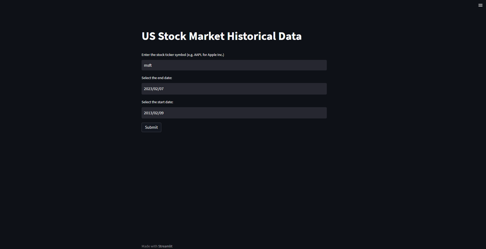

# Stock_Data_Fetcher

> Note: This python application utilizes Streamlit to allow the user to be able to 
> download up to at least 10 years of historical US stock data. 

## Run the application locally 

> pip install yahoo-finance
> streamlit run app.py 

## Run the application through URL 
